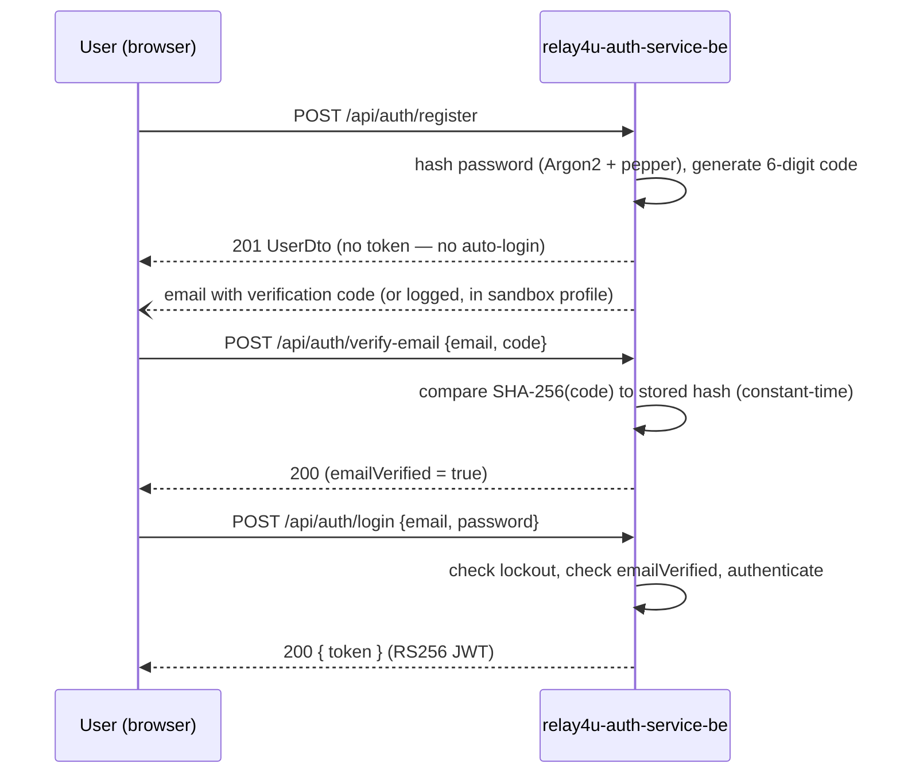

# Architecture

## JWT signing and JWKS

`security/JwtUtil.java` holds an RSA keypair:
- If `jwt.private-key` (env `JWT_PRIVATE_KEY`, PKCS8 PEM) is set, it's parsed and the public key derived from it.
- Otherwise, a fresh 2048-bit RSA keypair is generated **in memory at startup**. Fine for local dev — but every restart invalidates every previously-issued token and rotates the public key, so production deployments must set a persistent `JWT_PRIVATE_KEY`.

`generateToken(User user)` builds an RS256 JWT (via `jjwt`):

| Claim | Value |
|---|---|
| `sub` | `user.getId()` as a string (numeric database id — **not** the email) |
| `email` | `user.getEmail()` |
| `name` | `user.getName()` |
| `iss` | `jwt.issuer` (default `https://auth.relay4u.eu`) |
| `iat` / `exp` | issued-at / expiry (`jwt.expiration.in.hours`, default 24h) |
| header `kid` | `auth-key-1` (constant) |

`GET /.well-known/jwks.json` (`JwksController`) publishes the corresponding **public** key as a standard JWKS document (via `nimbus-jose-jwt`), keyed by the same `kid`. Any service can fetch this and validate tokens without ever holding the private key or a shared secret — see `eu-relay-4u-prospecting-be`'s [architecture doc](https://github.com/prospect-tool-relay4u-eu/prospect-tool-be) for the consumer side.

## Account lockout and email-verification lifecycle

All constants come from `application.properties` and are overridable via environment variables of the same name (dot-to-underscore, uppercase — standard Spring relaxed binding for real OS env vars; if overriding via a local `.env` file, use the exact dotted property name).

| Rule | Property | Value |
|---|---|---|
| Max failed logins before lockout | `security.lockout.max-attempts` | 5 |
| Lockout duration | `security.lockout.duration-minutes` | 10 |
| Verification code expiry | `verification.code.expiry-minutes` | 15 |
| Max verification attempts (per code) | `verification.code.max-attempts` | 5 |
| Max resends per rolling hour | `verification.resend.max-per-hour` | 3 |
| JWT expiration | `jwt.expiration.in.hours` | 24 |

Verification codes are 6 digits (`SecureRandom`), stored **only** as a SHA-256 hex hash (never in plaintext), and compared using `MessageDigest.isEqual` (constant-time, to resist timing attacks). The resend counter automatically resets once `lastResendAt` is more than an hour old.

## End-to-end flow

Registration does **not** auto-login — the client must call `/login` separately after the user verifies their email. See [`endpoints/auth.md`](endpoints/auth.md) for the per-endpoint detail and failure paths.
