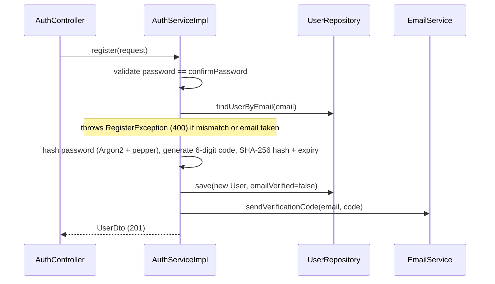
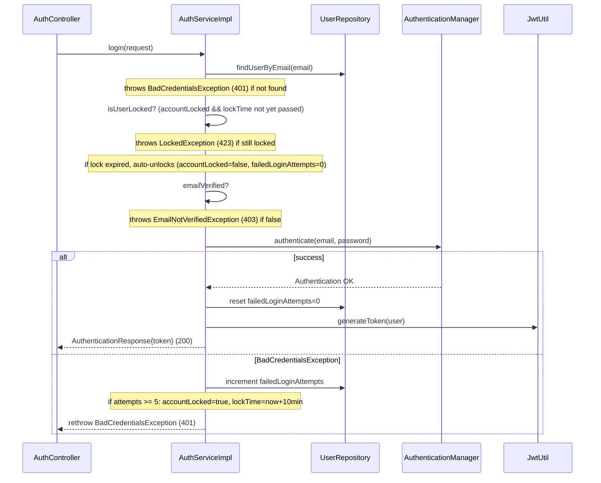
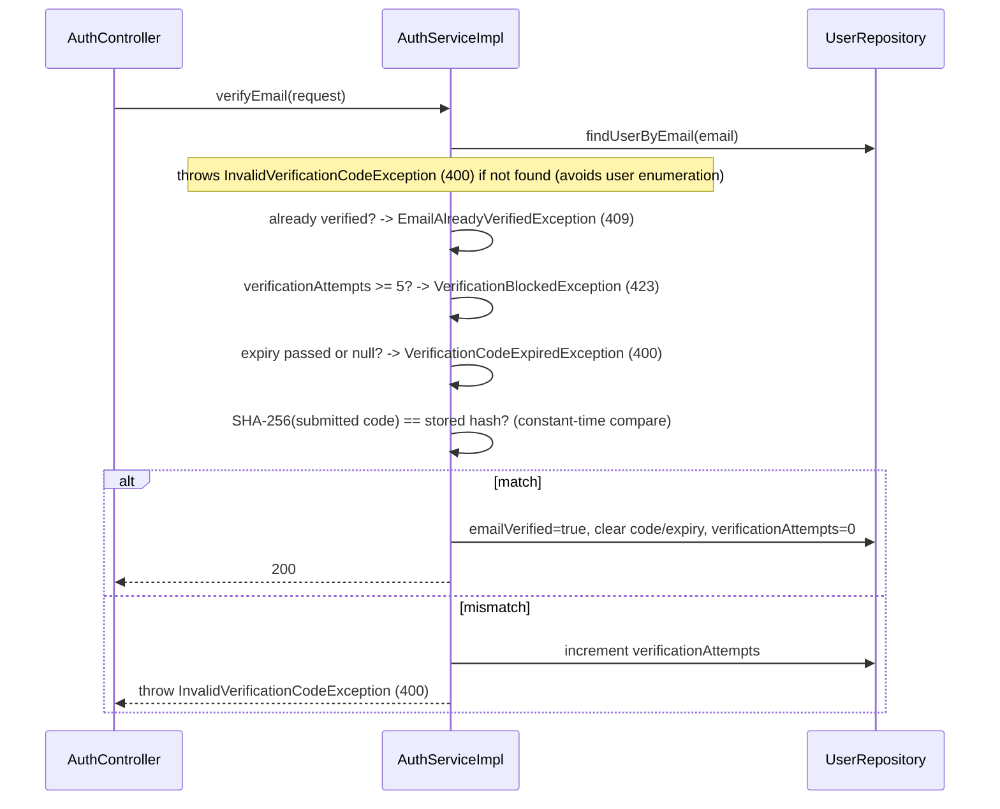
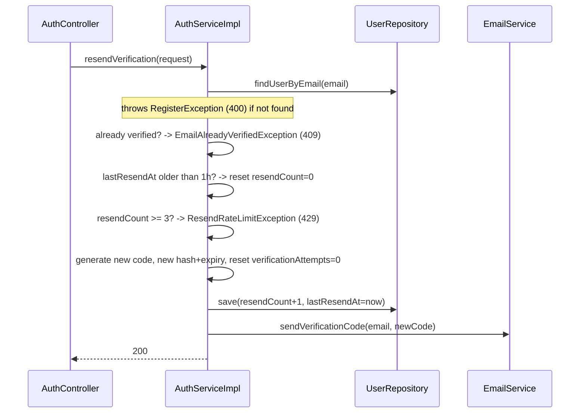

# `AuthController` — `/api/auth`

All endpoints are public (no JWT required — this is the service that issues them). Every endpoint delegates from `AuthController` straight into `AuthServiceImpl` (`service.userService`); the controller itself holds no business logic.

## Endpoints

| Method | Path | Request | Response | Status |
|---|---|---|---|---|
| POST | `/register` | `RegisterRequest{name, email, password, confirmPassword}` | `UserDto{id, name, email}` | 201 Created |
| POST | `/login` | `LoginRequest{email, password}` | `AuthenticationResponse{token}` | 200 OK |
| POST | `/verify-email` | `VerifyEmailRequest{email, code}` (code: 6 digits) | – | 200 OK |
| POST | `/resend-verification` | `ResendVerificationRequest{email}` | – | 200 OK |

Request validation (Bean Validation): `email` must be a valid email, `password` min length 8 and must contain an uppercase letter, a digit and a special character, `code` must match `^\d{6}$`.

**Registration does not return a token** — there is no auto-login. The client must call `/login` separately, and `/login` will reject unverified accounts (see below).

## Flow: register

## Flow: login

The most complex flow — lockout state and email-verification state are both checked before credentials are even validated by Spring Security's `AuthenticationManager`.

## Flow: verify-email

## Flow: resend-verification

Rate-limited to 3 resends per rolling hour (`verification.resend.max-per-hour`); the counter resets automatically once `lastResendAt` is more than an hour old.

